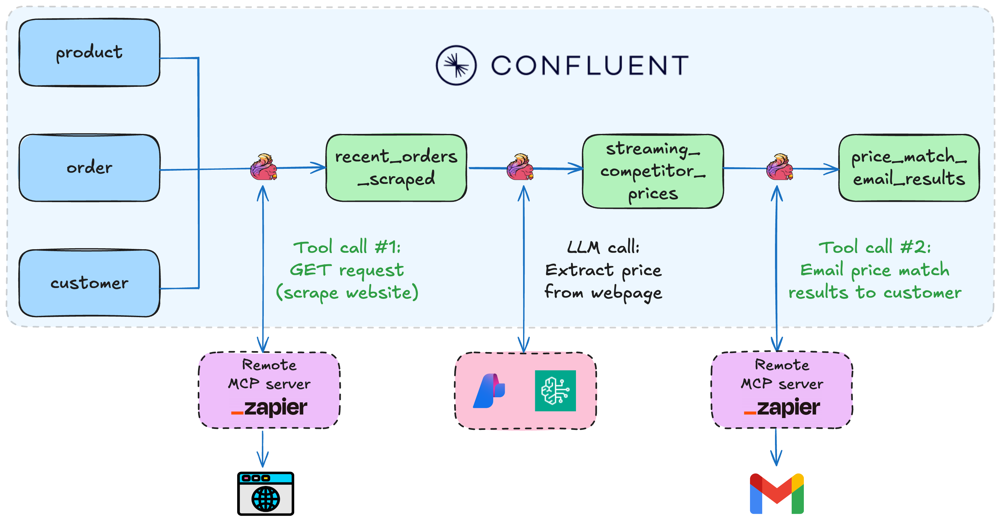
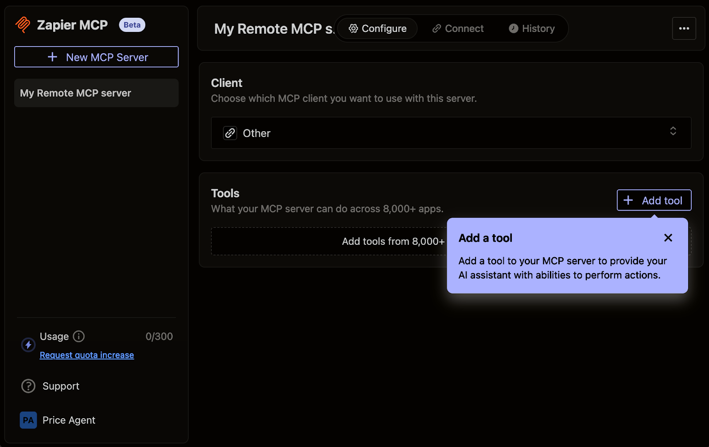
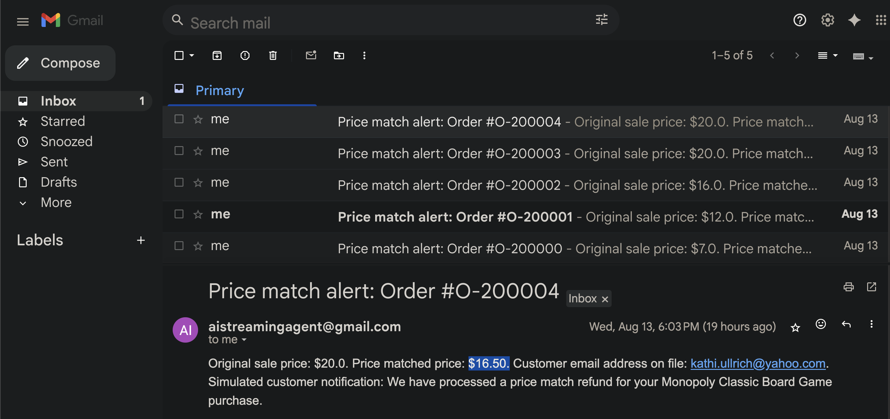

# Lab1: Tool Calling Agent Walkthrough

In this lab, we'll use Apache Flink for Confluent Cloud's MCP tool calling feature to "price match" products in customer orders in real-time. The LLM, through tool calling, uses a Zapier remote MCP server to retrieve competitor prices, and if a competitor offers a better price, the agent automatically applies a price match and uses tool calling again to email the customer a summary.



## Lab Architecture

This lab implements a three-agent pipeline:

1. **Agent 1: URL Scraping Agent** - Enriches orders with product names and scrapes competitor websites
2. **Agent 2: Price Extractor Agent** - Extracts competitor prices from scraped page content
3. **Agent 3: Price Match Notification Agent** - Compares our product price to competitor's price, and sends email notifications for price matches

## Prerequisites

- Run `uv run deploy` to deploy core infrastructure (see [main README](./README.md))
- Zapier account and remote MCP server set up  (instructions below)

## Zapier MCP Server Setup
<details>
<summary>Zapier MCP Server Setup (Click to expand)</summary>

Create a Zapier MCP server for tool calling:

### 1. Create free Zapier Account

Sign up at [zapier.com](https://zapier.com/sign-up) and verify your email.

### 2. Create MCP Server

Visit [mcp.zapier.com](https://mcp.zapier.com/mcp/servers), choose "Other" as MCP Client, and create your server.

<details open>
<summary>Click to collapse</summary>


</details>

### 3. Add Tools

Add these tools to your MCP server:

- **Webhooks by Zapier: GET** tool
- **Gmail: Send Email** tool (authenticate via SSO)

<details open>
<summary>Click to collapse</summary>



</details>

### 4. Get SSE Endpoint URL

Click **"Connect",** choose **"Other"** for your client, then change transport to **"SSE Endpoint"**, and **copy the URL.** This is the `ZAPIER_SSE_ENDPOINT` you will need to enter when deploying the lab`.

<details open>
<summary>Click to collapse</summary>


</details>

</details>

## Getting Started

### Test the LLM models before continuing

Once you've deployed Lab1 via `uv run deploy`, run the following queries in the SQL Workspace to make sure your models are working as expected:

#### Test Query 1: Base LLM model

```sql
SELECT
  question,
  response
FROM (SELECT 'How was the state of Colorado founded?' as question) t,
LATERAL TABLE(ML_PREDICT('llm_textgen_model', question, MAP['debug', 'true'])) as r(response);
```

#### Test Query 2: LLM Tool Calling Model

⚠️ IMPORTANT: Replace `<<YOUR-EMAIL-ADDRESS-HERE>>` in the query below with the email address where you want the email to delivered to. ⚠️️️

```sql
SELECT
    AI_TOOL_INVOKE(
        'zapier_mcp_model',
        'Use the gmail_send_email tool to send an email. 
         Instructions: send an email address to <<YOUR-EMAIL-ADDRESS-HERE>>, 
         subject "Direct Query Test", 
         body "This email was sent directly from Confluent Cloud!"',
        MAP[],
        MAP['gmail_send_email', 'Create and send a new email message'],
        MAP['debug', 'true']
    ) as response;
```

### Data Generation

Make sure Docker is running, then begin generating data with the following command:

```bash
uv run lab1_datagen
```

The data generator creates three interconnected data streams:

- **Customers**: 100 customer records with realistic names, emails, addresses, and state information
- **Products**: 17 product records including electronics, games, sports equipment, and household items with prices ranging from $5-$365
- **Orders**: Continuous stream of orders linking customers to products with timestamps

### Agent 1: URL Scraping Agent

First, we need to enrich incoming Orders with product names, then search for and scrape these products from competitors' websites. We'll achieve this using Flink's Tool Calling feature, which will enable Flink to invoke the Zapier MCP server we previously created.

Run this in Flink Workspace UI to start the first agent:

```sql
-- Get recent orders, scrape competitor website for same product
SET 'sql.state-ttl' = '1 HOURS';
CREATE TABLE recent_orders_scraped AS
SELECT
    o.order_id,
    p.product_name,
    c.customer_email,
    o.price as order_price,
    (AI_TOOL_INVOKE(
        'zapier_mcp_model',
        CONCAT('Use the webhooks_by_zapier_get tool to extract page contents. ',
               'Instructions: Extract the page contents from the following URL: ',
               'https://www.walmart.com/search?q="',
               p.product_name, '"'),
        MAP[],
        MAP['webhooks_by_zapier_get', 'Fire off a single GET request with optional querystrings.'],
        MAP['debug', 'true', 'on_error', 'continue']
    ))['webhooks_by_zapier_get']['response'] as page_content
FROM orders o
JOIN customers c ON o.customer_id = c.customer_id
JOIN products p ON o.product_id = p.product_id;
```

### Agent 2: Price Extractor Agent

Start **Agent 2** to extract the competitor's price from `page_content` and output it as a new field: `extracted_price`.

```sql
-- Extract prices from scraped webpages using AI_COMPLETE
CREATE TABLE streaming_competitor_prices AS
SELECT
    ros.order_id,
    ros.product_name,
    ros.customer_email,
    ros.order_price,
    llm.response as extracted_price
FROM recent_orders_scraped ros
CROSS JOIN LATERAL TABLE(
    AI_COMPLETE('llm_textgen_model',
        CONCAT('Analyze this search results page for the following product name: "', ros.product_name,
               '", and extract the price of the product that most closely matches the product name. ',
               'Return only the price in format: XX.XX. For example, return only: 29.95. ',
               'Page content: ', ros.page_content)
    )
) AS llm
WHERE ros.page_content IS NOT NULL
  AND ros.page_content NOT LIKE 'MCP error%'
  AND ros.page_content <> '';
```

In a new cell, check the output of `streaming_competitor_prices`

```sql
SELECT * FROM streaming_competitor_prices;
```


Notice the new field `extracted_price`. This will be used by the next Agent.

### Agent 3: Price Match Notification Agent

In this step, we'll notify the customer when a price match has been applied.
We'll again use Confluent Cloud's tool-calling feature — this time connecting to the Zapier MCP server to trigger an email or message to the customer. For this agent, the tool is `gmail_send_email`.

⚠️ IMPORTANT: Replace `<<YOUR-EMAIL-ADDRESS-HERE>>` in the query below with the email address where you want the email to delivered to. ⚠️️️

```sql
-- Create and send email notifications for price matches
CREATE TABLE price_match_email_results AS
SELECT
    scp.order_id,
    scp.customer_email,
    scp.product_name,
    CAST(CAST(scp.order_price AS DECIMAL(10, 2)) AS STRING) as order_price,
    CAST(CAST(scp.competitor_price AS DECIMAL(10, 2)) AS STRING) as competitor_price,
    CAST(CAST((scp.order_price - scp.competitor_price) AS DECIMAL(10, 2)) AS STRING) as savings,
    AI_TOOL_INVOKE('zapier_mcp_model',
                   CONCAT('Use the gmail_send_email tool to send an email. ',
                          'Instructions: send an email to: <<YOUR-EMAIL-ADDRESS-HERE>>, ',
                          'subject "✅ Great News! Price Match Applied - Order #', scp.order_id, '", ',
                          'body "Subject: Your Price Match Has Been Applied - Order #', scp.order_id, '

Dear Valued Customer,

We have great news! We found a better price for your recent purchase and have automatically applied a price match.

📦 ORDER DETAILS:
   • Order Number: #', scp.order_id, '
   • Product: ', scp.product_name, '

💰 PRICE MATCH DETAILS:
   • Original Price: $', CAST(CAST(scp.order_price AS DECIMAL(10, 2)) AS STRING), '
   • Competitor Price Found: $', CAST(CAST(scp.competitor_price AS DECIMAL(10, 2)) AS STRING), '
   • Your Savings: $', CAST(CAST((scp.order_price - scp.competitor_price) AS DECIMAL(10, 2)) AS STRING), '

✅ ACTION TAKEN:
We have processed a price match refund of $', CAST(CAST((scp.order_price - scp.competitor_price) AS DECIMAL(10, 2)) AS STRING),
' back to your original payment method. You should see this credit within 3-5 business days.

🛒 WHY WE DO THIS:
We are committed to offering you the best prices. Our automated price matching system continuously monitors competitor prices to ensure you always get the best deal.

Thank you for choosing River Retail. We appreciate your business!

Best regards,
River Retail Customer Success Team
📧 support@riverretail.com | 📞 1-800-RIVER-HELP

---
This is an automated message from our price matching system."'),
                   MAP[],
                   MAP['gmail_send_email', 'Create and send a new email message'],
                   MAP['debug', 'true', 'on_error', 'continue']) as email_response
FROM (
    SELECT *,
           TRY_CAST(extracted_price AS DECIMAL(10,2)) as competitor_price
    FROM streaming_competitor_prices
) scp
WHERE scp.competitor_price IS NOT NULL
  AND scp.competitor_price > 0
  AND scp.order_price > scp.competitor_price;
```

With Agent 3 running, our real-time price matching pipeline is complete—orders stream in, competitor prices are fetched and analyzed, and customers are instantly notified when they get the best deal.

Check out your email for price matched orders:

<details open>
<summary>Click to collapse</summary>



</details>

## Verification Queries

```sql
-- Check pipeline progress
SELECT 
    'Orders Scraped' as step,
    COUNT(*) as record_count
FROM recent_orders_scraped
WHERE page_content IS NOT NULL

UNION ALL

SELECT 
    'Prices Extracted' as step,
    COUNT(*) as record_count
FROM streaming_competitor_prices
WHERE extracted_price IS NOT NULL

UNION ALL

SELECT 
    'Emails Sent' as step,
    COUNT(*) as record_count
FROM price_match_email_results
WHERE email_response IS NOT NULL;
```

```sql
-- View successful price matches
SELECT 
    order_id,
    product_name,
    order_price,
    competitor_price,
    (CAST(order_price AS DECIMAL(10,2)) - CAST(competitor_price AS DECIMAL(10,2))) as savings
FROM price_match_email_results;
```


## Conclusion

By chaining these agents together, we've built a real-time data pipeline that reacts to market changes in seconds, ensures pricing competitiveness, and delivers immediate value to customers—right in their inbox.

## FOR SUBMISSION
The submission for the game will be after Lab2.


## Navigation

- **← Back to Overview**: [Main README](./README.md)
- **→ Next Lab**: [Lab2: Vector Search / RAG](./LAB2-Walkthrough.md)
- **Cleanup**: [Cleanup Instructions](./README.md#cleanup)
