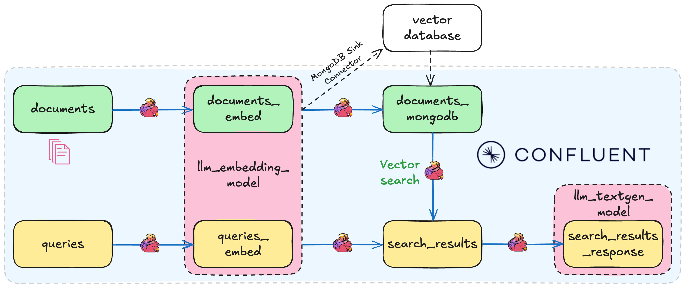
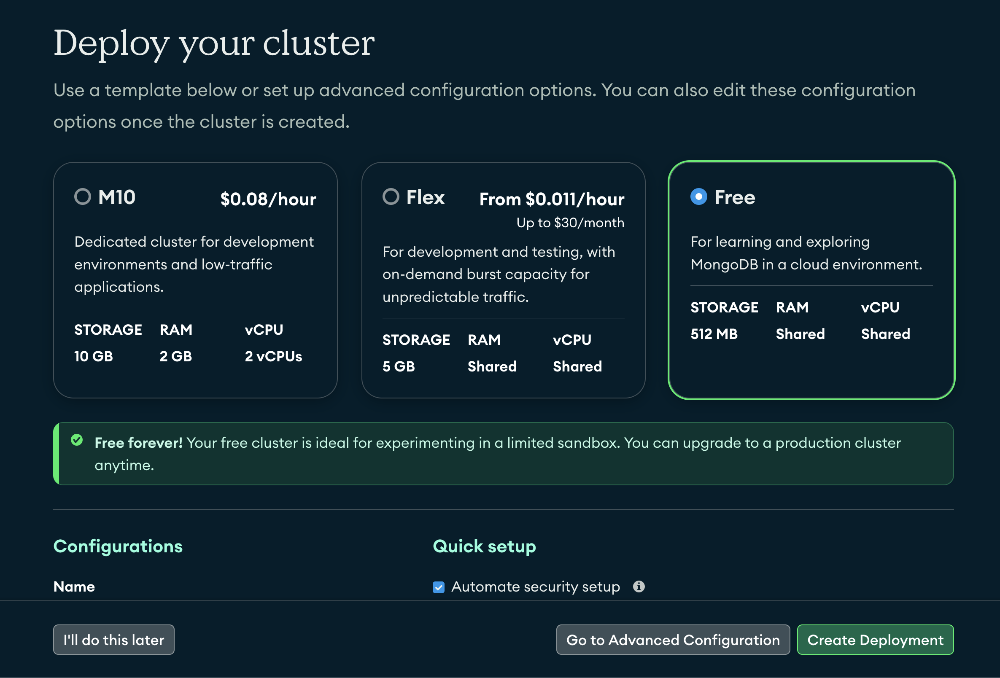
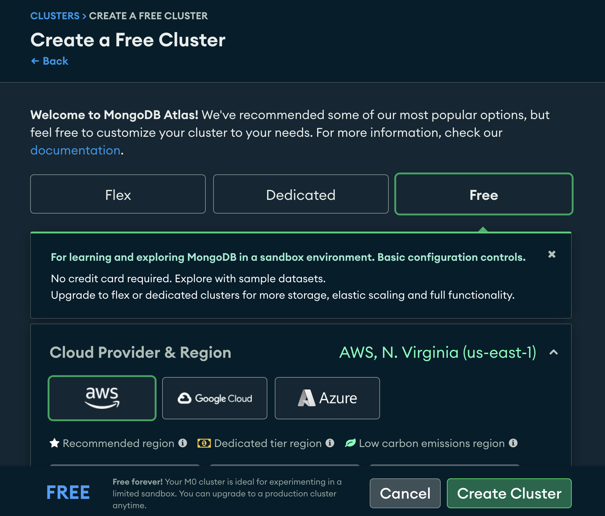
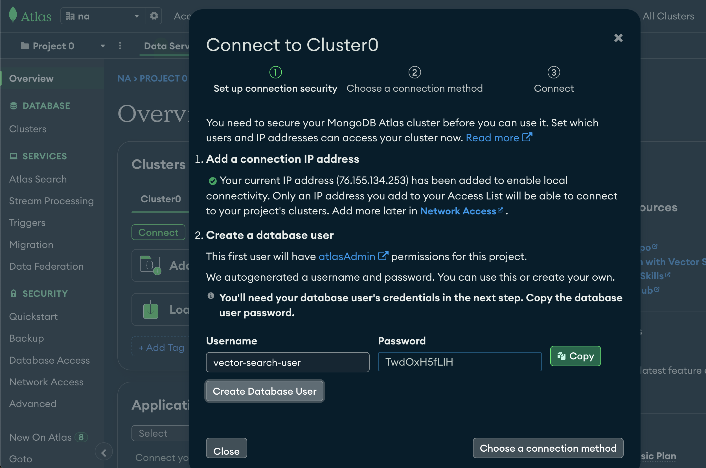
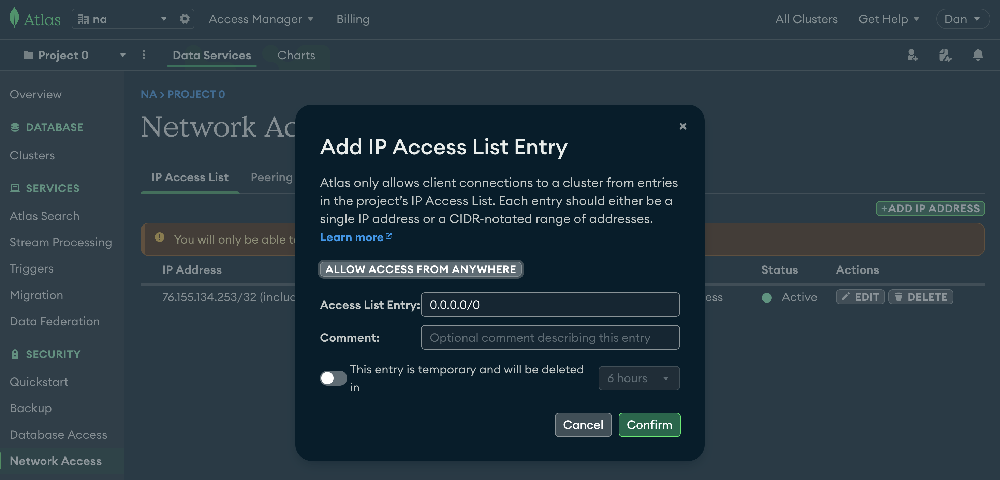
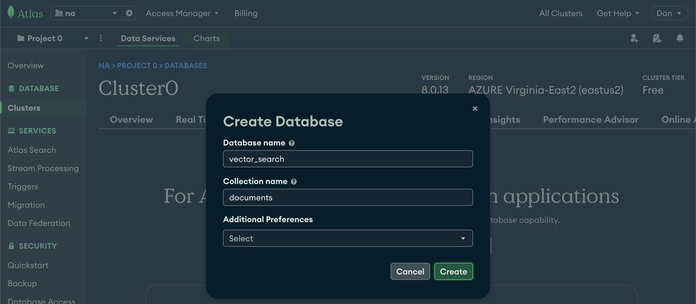
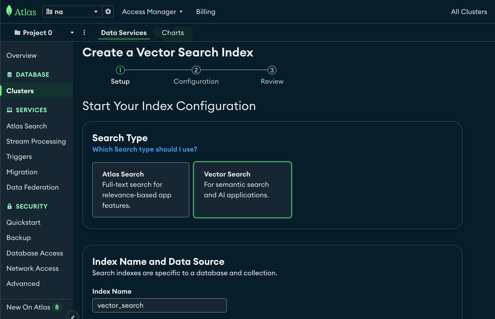

# Lab2: Vector Search / RAG Walkthrough

In this lab, we'll create a Retrieval-Augmented Generation (RAG) pipeline using Confluent Cloud for Apache Flink's vector search capabilities. The pipeline processes documents, creates embeddings, and enables semantic search to power intelligent responses through retrieval of relevant context.



## Prerequisites


- Complete the tasks to deploy core infrastructure (see [main README](./README.md))
- MongoDB free account with Atlas cluster (M0 - Free Tier) with vector search enabled - directions below.

## MongoDB Atlas Setup
<details>
<summary>MongoDB Atlas Setup (Click to expand)</summary>

### Step 1: Create MongoDB Atlas Account and Cluster

If running Lab2, set up a free MongoDB Atlas cluster:

#### 1. Create a **Project.**

<details open>
<summary>Click to collapse</summary>


</details>

#### 2. Create a **Cluster.**

<details open>
<summary>Click to collapse</summary>



</details>

#### 3. Choose the **Free Tier (M0).** Then choose your cloud provider as **AWS** and region as **us-east-1**. Unclick "preload sample dataset". Click **Create Cluster.**

<details open>
<summary>Click to collapse</summary>



</details>

#### 4. **Create a Database User.** **Write down the username and password** you choose, as they will be `mongodb_username` and `mongodb_password` that you will need to deploy Terraform later. Click **Create Database User** when you are done

   **Note:** the username and password you set up to access your database are the credentials you'll need to save for later, NOT the separate login you use for mongodb.com.

<details open>
<summary>Click to collapse</summary>



</details>

#### 5. Click **Choose a Connection method.** => Shell => Copy the URL shown in **step 2.** This is the `MONGODB_CONNECTION_URL` you will need later. Don't worry about the rest of the command - you only need the URL that looks like `mongodb+srv://cluster0.xhgx1kr.mongodb.net`

#### 6. Go to **Network Access** in left sidebar. Click green **Add IP Address** button on the right. Then simply click the **Allow Access From Anywhere** button, or manually enter `0.0.0.0/0`. Click **Confirm.**

 ⚠️ **NOTE:** Important step! Confluent Cloud will not be able to connect to MongoDB without this rule. ⚠️

<details open>
<summary>Click to collapse</summary>



</details>

#### 7. Next, from **Clusters** page, choose "Atlas Search" then click **Add my own data.** Enter

   Database name: `vector_search`

   Collection name: `documents`

<details open>
<summary>Click to collapse</summary>



</details>

#### 8. Next, click **Create Search Index.** Choose **Vector Search index, and name it `vector_search`

<details open>
<summary>Click to collapse</summary>


</details>

#### 9. Scroll down to the bottom and choose **JSON Editor.** Enter the following and click Next.

   ```json
   {
     "fields": [
       {
         "type": "vector",
         "path": "embedding",
         "numDimensions": 1536,
         "similarity": "cosine"
       }
     ]
   }
   ```

   </details>

During deployment, you'll be prompted to provide 3 MongoDB variables:
- `MONGODB_CONNECTION_STRING`: The connection URL from [Step 5](#step-1-create-mongodb-atlas-account-and-cluster) of MongoDB setup (e.g., `mongodb+srv://cluster0.abc123.mongodb.net`)
- `mongodb_username`: The database-specific username you created in [Step 4](#step-1-create-mongodb-atlas-account-and-cluster) (*different* from what you use to login to MongoDB)
- `mongodb_password`: The database-specific password you created in [Step 4](#step-1-create-mongodb-atlas-account-and-cluster)

This creates the complete RAG pipeline:
- **6 Flink tables** for the document-to-response flow (intentionally in alphabetical order from beginning to end of pipeline, to keep things tidy!):
  - `documents` 
  - `documents_embed`
  - `documents_vectordb` 
  - `queries`
  - `queries_embed`
  - `search_results`
  - `search_results_response`

- **LLM models** for embeddings and text generation: `llm_textgen_model` and `llm_embedding_model`
- **MongoDB sink connector** to stream embeddings from `documents_embed` to Atlas

## Using the RAG Pipeline

### Load Confluent Flink Documentation

The lab uses real Confluent Flink documentation as the knowledge base:

```bash
# Load 385 documents into the pipeline (run from anywhere in repo)
uv run publish_docs
```

This publishes pre-chunked Flink documentation that gets:
1. **Embedded** using the LLM embedding model
2. **Stored** in MongoDB Atlas with vector search index
3. **Made searchable** for semantic queries

### Query the RAG System

```bash
# Publish queries (run from anywhere in repo)
uv run publish_queries # starts interactive mode (recommended), or:
uv run publish_queries "How do I use window functions in Flink?"
```

The vector search results can be found in the `search_results` table, and the RAG (retrieval-augmented generation) results can be found in the  `search_results_response` table. They contain:

- Source document snippets with similarity scores comparing query to document text
- Citations from the knowledge base
- AI-generated response based on retrieved docs (`search_results_response` only)

### View Results in Confluent Cloud

Monitor the pipeline in Confluent Cloud SQL workspace:

```sql
-- Check data flow through pipeline
SELECT COUNT(*) FROM documents;        -- 385 Flink docs
SELECT COUNT(*) FROM documents_embed;  -- Docs with embeddings
SELECT COUNT(*) FROM queries;          -- Your questions
SELECT COUNT(*) FROM queries_embed;    -- Queries with embeddings

-- See vector search results
SELECT * FROM search_results LIMIT 5;

-- View final RAG responses
SELECT query, response FROM search_results_response LIMIT 5;
```

## Troubleshooting

<details>
<summary>Click to expand</summary>

### Script Issues
```bash
# If publish_docs.py fails
✗ Missing required dependencies!
→ Run: pip install .

✗ Terraform state not found!
→ Ensure you ran terraform apply successfully
```

### Pipeline Issues
```sql
-- Debug data flow (run in Confluent Cloud SQL workspace)
SELECT COUNT(*) FROM documents;                -- Should be 385 after publish_docs.py
SELECT COUNT(*) FROM documents_embed;          -- Should match documents count
SELECT COUNT(*) FROM queries;                  -- Number of queries you sent
SELECT COUNT(*) FROM search_results_response;  -- Final RAG responses
```

### MongoDB Issues
- **Connection failed**: Verify IP allowlist includes `0.0.0.0/0`
- **No vector search**: Confirm Atlas vector search index `vector_search` is active
- **Wrong credentials**: Use database user (not MongoDB.com login)

### Common Fixes
1. **Pipeline not processing**: Wait 30-60 seconds after publishing documents
2. **No query responses**: Check that LLM models are deployed in core infrastructure
3. **Empty results**: Verify MongoDB connector status in Confluent Cloud

</details>

## SUBMISSION
* After completing both labs, you need to submit 2 files for this challenge.

* Please enter the same name, surname and email address with previous challenge.

1) Take screen shot of the email you've received for price match. The screenshot should include, subject, whole body and time when it is received.

Example:


2) Schema output for the "documents" data product. Please copy/paste the schema to the given input in the form. For more information on how to work with data products please refer to ([Confluent Cloud Documents](https://docs.confluent.io/cloud/current/overview.html))

**You have to submit these 2 requirements shot to the below link**

([Submit your Streaming Agents Task](https://forms.gle/R9GykZPZpLHA99rt9))


## Navigation

- **← Back to Overview**: [Main README](./README.md)
- **← Previous Lab**: [Lab1: Tool Calling Agent](./LAB1-Walkthrough.md)
- **🧹 Cleanup**: [Cleanup Instructions](./README.md#cleanup)
