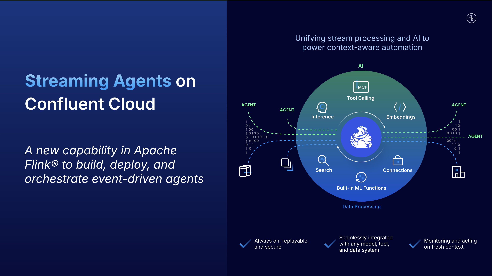

# Streaming Agents on Confluent Cloud Quickstart

[](https://www.confluent.io/get-started/?utm_campaign=tm.pmm_cd.q4fy25-quickstart-streaming-agents&utm_source=github&utm_medium=demo)




Build real-time AI agents with [Confluent Cloud Streaming Agents](https://docs.confluent.io/cloud/current/ai/streaming-agents/overview.html). This quickstart includes two hands-on labs:

<table>
<tr>
<th width="25%">Lab</th>
<th width="75%">Description</th>
</tr>
<tr>
<td><a href="./LAB1-Walkthrough.md"><strong>Lab1 - MCP Tool Calling</strong></a></td>
<td>Price matching agent that scrapes competitor websites and adjusts prices in real-time<br><br></td>
</tr>
<tr>
<td><a href="./LAB2-Walkthrough.md"><strong>Lab2 - Vector Search - RAG</strong></a></td>
<td>Vector search pipeline with optional retrieval augmented generation (RAG) for intelligent document retrieval<br><br></td>
</tr>
</table>

## Demo Video

[](https://www.youtube.com/watch?v=F4bUUsVDBVE "Watch on YouTube")

## Prerequisites

**Required accounts & credentials:**

- [](https://www.confluent.io/get-started/?utm_campaign=tm.pmm_cd.q4fy25-quickstart-streaming-agents&utm_source=github&utm_medium=demo)
- **Lab1:** Zapier account + SSE endpoint URL
<details open>
<summary> - Zapier MCP Server Setup (Click to expand)</summary>

Create a Zapier MCP server for tool calling:

### 1. Create free Zapier Account

Sign up at [zapier.com](https://zapier.com/sign-up) and verify your email.

### 2. Create MCP Server

Visit [mcp.zapier.com](https://mcp.zapier.com/mcp/servers), choose "Other" as MCP Client, and create your server.


### 3. Add Tools

Add these tools to your MCP server:

- **Webhooks by Zapier: GET** tool
- **Gmail: Send Email** tool (authenticate via SSO)


### 4. Get SSE Endpoint URL

Click **"Connect",** choose **"Other"** for your client, then change transport to **"SSE Endpoint"**, and **copy the URL.** This is the `ZAPIER_SSE_ENDPOINT` you will need to enter when deploying the lab with `uv run deploy`.


</details>


- **Lab2:** MongoDB Atlas + connection string, database-specific user credentials 
## MongoDB Atlas Setup
<details>
<summary>MongoDB Atlas Setup (Click to expand)</summary>

### Step 1: Create MongoDB Atlas Account and Cluster

If running Lab2, set up a free MongoDB Atlas cluster:

#### 1. Create a **Project.**

<details open>
<summary>Click to collapse</summary>


</details>

#### 2. Create a **Cluster.**

<details open>
<summary>Click to collapse</summary>


</details>

#### 3. Choose the **Free Tier (M0).** Then choose your cloud provider (AWS or Azure) and region. Make sure this is the same region that your Confluent Cloud deployment is in. Click **Create Cluster.**

<details open>
<summary>Click to collapse</summary>


</details>

#### 4. **Create a Database User.** **Write down the username and password** you choose, as they will be `mongodb_username` and `mongodb_password` that you will need to deploy Terraform later. Click **Create Database User** when you are done

   **Note:** the username and password you set up to access your database are the credentials you'll need to save for later, NOT the separate login you use for mongodb.com.

<details open>
<summary>Click to collapse</summary>


</details>

#### 5. Click **Choose a Connection method.** => Shell => Copy the URL shown in **step 2.** This is the `MONGODB_CONNECTION_URL` you will need later. Don't worry about the rest of the command - you only need the URL that looks like `mongodb+srv://cluster0.xhgx1kr.mongodb.net`

#### 6. Go to **Network Access** in left sidebar. Click green **Add IP Address** button on the right. Then simply click the **Allow Access From Anywhere** button, or manually enter `0.0.0.0/0`. Click **Confirm.**

 ⚠️ **NOTE:** Important step! Confluent Cloud will not be able to connect to MongoDB without this rule. ⚠️

<details open>
<summary>Click to collapse</summary>


</details>

#### 7. Next, from **Clusters** page, choose "Atlas Search" then click **Add my own data.** Enter

   Database name: `vector_search`

   Collection name: `documents`

<details open>
<summary>Click to collapse</summary>


</details>

#### 8. Next, click **Create Search Index.** Choose **Vector Search index, and name it `vector_search`

<details open>
<summary>Click to collapse</summary>


</details>

#### 9. Scroll down to the bottom and choose **JSON Editor.** Enter the following

   ```json
   {
     "fields": [
       {
         "type": "vector",
         "path": "embedding",
         "numDimensions": 1536,
         "similarity": "cosine"
       }
     ]
   }
   ```

<details open>
<summary>Click to collapse</summary>


</details>

</details>


## 🚀 Quick Start

Before you begin, ensure you are connected to the EC2 machine. If you are not, you can connect to the machine by typing below command:

```bash
ssh -i ./<name of the pem file>.pem ubuntu@<PublicDNS>
```


* **Clone the repository:**
   Run below command to clone the repo.

```bash
git clone https://github.com/korzan-og/quickstart-streaming-agents.git
cd quickstart-streaming-agents/
```

* **Run AWS export commands that you coped from Workshop studio event. Ensure you have changed keys and tokens with your own values**

```bash
export AWS_DEFAULT_REGION="us-east-1"
export AWS_ACCESS_KEY_ID="<YOUR_AWS_ACCESS_KEY_ID>"
export AWS_SECRET_ACCESS_KEY="<YOUR_AWS_SECRET_ACCESS_KEY>"
export AWS_SESSION_TOKEN="<YOUR_AWS_SESSION_TOKEN>"
```
* [Sign in to Confluent Cloud](https://confluent.cloud/auth_callback)

* [Create an API key](https://docs.confluent.io/cloud/current/security/authenticate/workload-identities/service-accounts/api-keys/manage-api-keys.html#add-an-api-key).<br>
         a. Navigate to the hamburger icon on top right corner and select **API Keys**.<br>
         b. Click **Add API Key**.<br>
         c. Select "My Account" and click "Next".<br>
         d. Select **Cloud resource Management** and below this and click "Next".<br>
         
         e. Add a name and a description and click "Next".<br>
         f. Click "Download API Key" at the bottom beside Complete button and once downloaded, click "Complete"<br>
         g. Modify below script and change <cloud_api_key> and <cloud_api_secret> with your values and run the commands.
 ```bash
    export CONFLUENT_CLOUD_API_KEY="<cloud_api_key>"
    export CONFLUENT_CLOUD_API_SECRET="<cloud_api_secret>"
```


* **Run below commands to start the deployment:**

```bash
python3 -m venv venv
source venv/bin/activate
pip install -e .
python deploy.py
```

That's it! The script will guide you through setup, automatically create API keys. 

- Ensure you deploy **all 3 labs** .

- Ensure you select **aws** as your Cloud vendor.

- Ensure you select **us-east-1** as your regions.

* When script fails deployment continue with Lab 1.

## Cleanup

**You may need to refresh AWS exports with below commands**

```bash
export AWS_DEFAULT_REGION="us-east-1"
export AWS_ACCESS_KEY_ID="<YOUR_AWS_ACCESS_KEY_ID>"
export AWS_SECRET_ACCESS_KEY="<YOUR_AWS_SECRET_ACCESS_KEY>"
export AWS_SESSION_TOKEN="<YOUR_AWS_SESSION_TOKEN>"
```

```bash
# Automated
uv run destroy
```